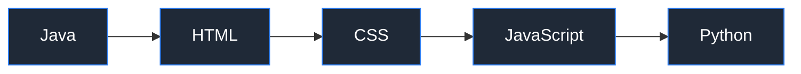
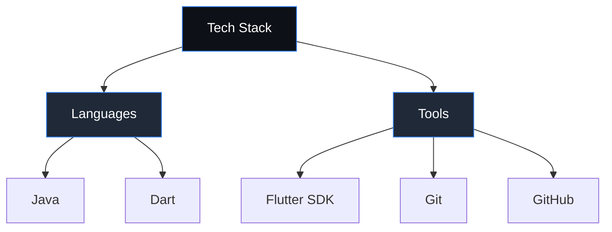

<h1 align="center">Angelchelssa</h1>
<h3 align="center">Information Technology Student</h3>

Focused on Java fundamentals and cross-platform mobile development with Flutter

  
  
  

---

### About Me

I am an Information Technology student building a strong foundation in programming through structured coursework and independent practice. My current focus is on **Java** for core programming logic and **Flutter** for mobile application development.

| | |
|---|---|
| 🎓 **Education** | Information Technology |
| 💻 **Core Focus** | Object-Oriented Programming (Java) |
| 📱 **Currently Learning** | Flutter for mobile app development |
| 🌱 **Approach** | Learning by building — one jobsheet, one project at a time |
| 📫 **Contact** | angelchelsa150526@gmail.com |

---

### Learning Roadmap

---

### Tech Stack

  

---

### GitHub Stats

  
  

  
  

---

### Contribution Activity

  

---

### Quote of the Day

  

---

### Featured Repositories

| Repository | Description | Language |
|---|---|---|
| [daspro-jobsheet1](https://github.com/angelchelssa/daspro-jobsheet1) | Repositoriku yang pertama | Java |
| [daspro-jobsheet2](https://github.com/angelchelssa/daspro-jobsheet2) | Jobsheet praktikum dasar pemrograman | Java |
| [daspro-jobsheet3](https://github.com/angelchelssa/daspro-jobsheet3) | Jobsheet praktikum dasar pemrograman | Java |
| [kuis-1](https://github.com/angelchelssa/kuis-1) | Latihan evaluasi materi | Java |

---

  Thank you for visiting my profile. Feel free to explore my repositories or reach out via email.

