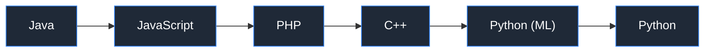
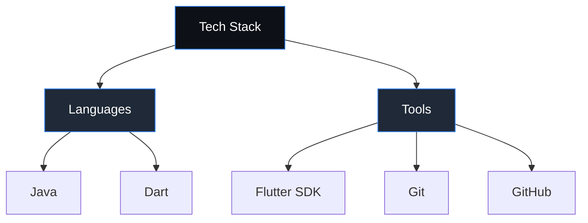

<h1 align="center">Angelchelssa</h1>
<h3 align="center">Information Technology Student</h3>

Focused on Java fundamentals and cross-platform mobile development with Flutter

  
  

---

### About Me

I am an Information Technology student building a strong foundation in programming through structured coursework and independent practice. My current focus is on **Java** for core programming logic and **Flutter** for mobile application development.

| | |
|---|---|
| 🎓 **Education** | Information Technology |
| 💻 **Core Focus** | Object-Oriented Programming (Java) |
| 📱 **Currently Learning** | Flutter for mobile app development |
| 🌱 **Approach** | Learning by building — one jobsheet, one project at a time |
| 📫 **Contact** | angelchelsa150526@gmail.com |

---

### Learning Roadmap

<!-- LEARNING-ROADMAP:START -->

<!-- LEARNING-ROADMAP:END -->

---

### Tech Stack

<!-- TECH-STACK:START -->

  

<!-- TECH-STACK:END -->

---

### GitHub Stats

  

<table align="center">
  <tr>
    <td></td>
    <td></td>
    <td></td>
  </tr>
</table>

---

### Contribution Activity

  <picture>
    <source media="(prefers-color-scheme: dark)" srcset="https://raw.githubusercontent.com/angelchelssa/angelchelssa/output/pacman-contribution-graph-dark.svg">
    <source media="(prefers-color-scheme: light)" srcset="https://raw.githubusercontent.com/angelchelssa/angelchelssa/output/pacman-contribution-graph.svg">
    
  </picture>

---

### My Motto

  <i>"Plot twist: used to avoid computers, now debugs them daily. Never planned, just how it turned out."</i>

---

### Featured Repositories

| Repository | Description | Language |
|---|---|---|
| [244107020202-mobile-course](https://github.com/angelchelssa/244107020202-mobile-course) | Mobile development coursework | C++ |
| [Pembelajaran-Mesin-2026](https://github.com/angelchelssa/Pembelajaran-Mesin-2026) | Machine learning coursework | Jupyter Notebook |
| [PraktikumPWL](https://github.com/angelchelssa/PraktikumPWL) | Web programming practicum | PHP |
| [PWL_UTS](https://github.com/angelchelssa/PWL_UTS) | Web programming midterm project | PHP |

---

  Thank you for visiting my profile. Feel free to explore my repositories or reach out via email.

